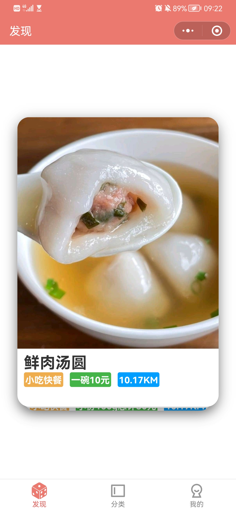
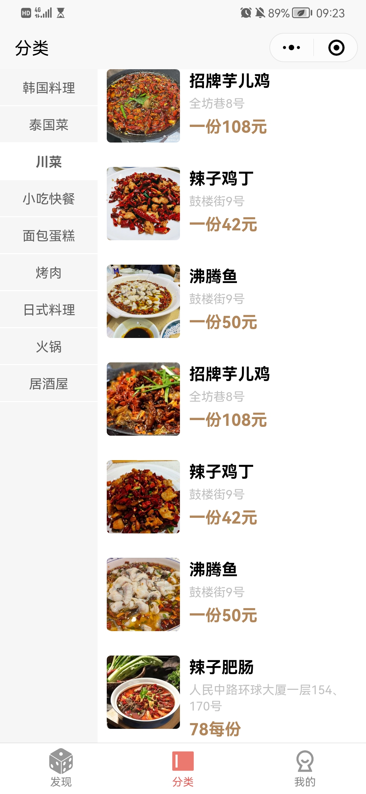
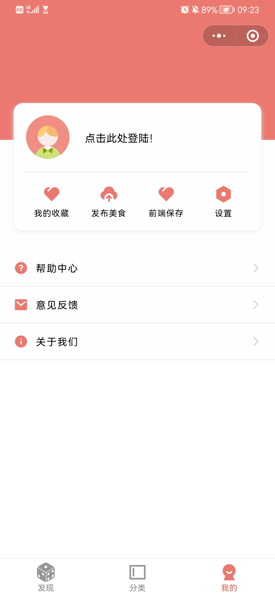
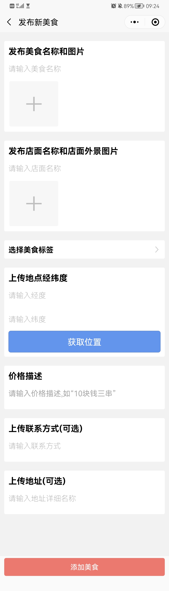

# Cuisine Dice

Tag: uni-app, vue, wechat, cloud development

## Pages and Basic Functions

### Dice Find

-   This app can get your current location and display restaruants which are close to you (default value is within 500 m). Only a main picture of the cuisine and major information are showed (category, price, and distance).
-   Favor or Not: you can easily filtrate the cuisine by gestures (Right is favor, left is dislike it). If you login your account, you can find them in your favorite later.
-   Click the card,&#x20;
-   The cards are infinite, if cuisine is over, you would have blank cards.

    

### Category

-   The page of categories and the sets of cuisine.

    

### My

-   The page to login, check favorite and upload new cuisine.
-   ♥ is for opening favorite food page;
-   Upload button allow users to upload new cuisine infor they discover.

    

### Add New Cuisine

-   This is the page to upload new cuisine.
-   Choose a category from exsist tags
-   Photos preview is available.&#x20;
-   Auto getting location is available.

    
